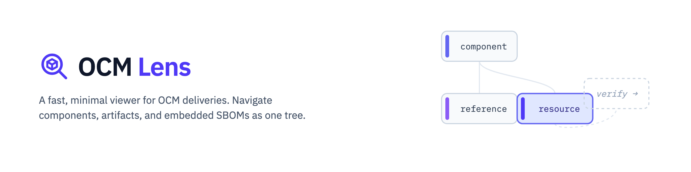
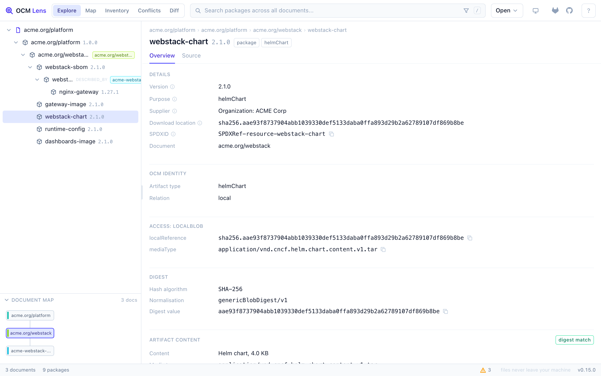

# OCM Lens

A fast, minimal viewer for [Open Component Model](https://ocm.software) (OCM)
deliveries. Drop a CTF archive, a component archive, or a plain component
descriptor and see what is actually inside: components, resources, references,
the transported artifact contents, and whether digests and signatures hold.
Everything runs client-side, in your browser or your editor; files never leave
your machine.

**Try it:** <https://ocm-lens.everbright-it.de/app/> (a demo delivery is one
click away). The landing page lives at <https://ocm-lens.everbright-it.de/>.
The VS Code extension is on
[Open VSX](https://open-vsx.org/extension/everbright-it/ocmlens).

## Why OCM Lens

- **It reads the delivery, not just the descriptor.** Common Transport Format
  archives (both index layouts) and component archives open directly; so do
  standalone component descriptors (schema v2 fully, v3alpha1 best effort,
  YAML or JSON). Component references resolve across everything you load
  into one continuous tree.
- **Artifact contents are visible.** Transported blobs are inspected in a Web
  Worker: Helm charts show their file list and Chart.yaml / values.yaml
  previews, OCI artifact sets show manifest and layer tables, text and
  JSON/YAML blobs get previews, binaries a hex head. Raw bytes never reach
  the UI thread.
- **Digests are checked, not just displayed.** `genericBlobDigest/v1` and
  `ociArtifactDigest/v1` are recomputed per resource and reported as match,
  mismatch, or unchecked. Never guessed.
- **Signatures verify in the browser.** Paste a public key or certificate and
  OCM Lens recomputes the normalised descriptor digest (`jsonNormalisation`
  v4alpha1, v3, v2) and checks the RSA signature (RSASSA-PSS and
  PKCS1-v1_5, SHA-256/512) with the browser's own WebCrypto, verified
  byte-for-byte against the real `ocm` CLI. No server involved, no upload.
- **Structural lint.** Every descriptor is checked against the spec's
  structural rules and reports warnings (`OCM_SCHEMA_*`) without refusing
  to load.
- **Embedded SBOMs join the tree.** SPDX SBOMs shipped inside a delivery are
  extracted, linked to their resources, and resolved into the same cascade,
  so a release, its components, and their SBOMs read as one structure.
- **Analysis included.** Cross-delivery inventory, version conflicts, and a
  release-to-release diff that also sees content changes (same version,
  different digest). Quality reports run on declarative compliance profiles,
  with an "OCM component essentials" preset built in.

## Get it

- **Web app:** <https://ocm-lens.everbright-it.de/app/>. Nothing to install.
- **VS Code / VSCodium:** install
  [`everbright-it.ocmlens`](https://open-vsx.org/extension/everbright-it/ocmlens)
  from Open VSX. It opens `component-descriptor.yaml` files and `.ctf` /
  component-archive tars, and can scan the workspace for deliveries.

## Where the code lives

OCM Lens is developed in the
[sbom-lens monorepo](https://gitlab.com/everbrightit-group/sbom-lens)
together with its sibling product
[SBOM Lens](https://sbom-lens.everbright-it.de/), an SPDX viewer. The two
share the viewer engine, the web UI, and the VS Code shell (about 91 percent
of the code), so they release in lockstep from one codebase, while a CI gate
keeps each product's bundle free of the other product's code.

This repository is the product home for OCM Lens. **Code, issues, and merge
requests live in the monorepo:**
<https://gitlab.com/everbrightit-group/sbom-lens> (use the `ocm-lens` label
for issues). Releases are tagged there; the shared changelog is
[CHANGELOG.md](https://gitlab.com/everbrightit-group/sbom-lens/-/blob/main/CHANGELOG.md).

## Scope and limits

Read-only by design: OCM Lens views and verifies deliveries, it does not
create, sign, or transport them. Signature verification covers RSASSA-PSS and
PKCS1-v1_5 with SHA-256/512; certificate chains, timestamping, and
`jsonNormalisation/v1` are out of scope and reported as unverifiable rather
than guessed. Plain `.tar` deliveries stream from disk, so multi-GB release
bundles open; blobs over 64 MB are indexed without a content preview (their
digest verdict still runs), compressed `.tgz` is capped at 2 GiB
decompressed. The full list, stated plainly, lives in
[docs/ocm.md](https://gitlab.com/everbrightit-group/sbom-lens/-/blob/main/docs/ocm.md).

## Security

Report vulnerabilities privately to <tech@everbright-it.de>. Policy:
[SECURITY.md](SECURITY.md).

## License

[Apache-2.0](LICENSE). OCM Lens is an independent open-source project by
[EverBright IT](https://everbright-it.de) and is not affiliated with the
Open Component Model project or the NeoNephos Foundation.
